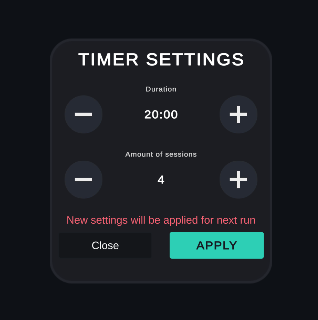

# LockIn - Unity Client

Unity client for a session-based focus tracking application with backend synchronization.

The project focuses on reactive state handling, synchronization with backend session state, and responsive UI architecture for mobile platforms.

Client is designed to work with [ASP.NET Core backend API](https://github.com/S0dya/Timer).


---

# Overview

The client handles:

* timer visualization
* session flow
* authentication flow
* state synchronization
* settings management
* history rendering
* backend communication

The application is designed around uninterrupted focus sessions instead of traditional Pomodoro cycles.

Runs can last from a single session to multiple days depending on the user's workflow.

---

# Technical Stack

* **Unity**
* **Zenject** 
* **UniRx** 
* **UniTask** 
* **DOTween** 

---

# Architecture

## MVVM Structure

The project uses a lightweight MVVM approach.

* Views render state and forward input
* ViewModels handle logic and orchestration
* Services communicate with backend APIs
* States act as reactive data containers

---

## Reactive State System

Application state is centralized and synchronized through reactive streams.

```csharp
public class AppState
{
    public ReactiveProperty<UserState> CurrentUser = new();
    public ReactiveProperty<RunState> RunState = new();
    public ReactiveProperty<TimerSettingsState> TimerSettingsState = new();
    public ReactiveProperty<int> CurrentSessionTime = new();
}
```

---

## Synchronization Flow

The client synchronizes backend state during:

* app launch
* login
* reconnects
* foreground/background transitions

The backend remains the source of truth for active sessions and run progression.

The client mainly validates, visualizes, and synchronizes state.

```csharp
_appState.CurrentUser
    .Subscribe(OnCurrentUserChanged)
    .AddTo(_disposables);

private async UniTask LoadStates()
{
    if (_appState.CurrentUser.Value != null)
    {
        await _timerSettingsViewModel.Init();
        await _runViewModel.Init();
    }
}
```

---

# Core Features

## Authentication

Simple username/password authorization flow using JWT tokens.

* login/register windows
* token persistence
* automatic session restoration


---

## Run & Session 

A session represents uninterrupted focus time.

The client handles:

* timer countdown
* visual timer progression
* session completion flow
* run submission flow
* cancellation flow

The timer UI is synchronized with backend timestamps instead of relying purely on local countdown logic.


## Run History

History is rendered as lightweight reusable UI entries designed for potentially large run lists.

Each entry displays:

* completion state
* completed/planned sessions
* duration
* description
* run consistency

## Timer Settings

Settings openable in any state of the application

User can set :

* duration
* amount of sessions

Changes are applied to the next started run, preventing changing timer settings as run is already going



---

# Technical Challenges Solved

## State Consistency

Keeping frontend state synchronized with backend state after reconnects and app lifecycle interruptions.

---

## Request Concurrency

Preventing duplicate operations and overlapping requests during session actions.

```csharp
if (_isOperationInProgress)
    return;
```

---

## Timer Synchronization

Ensuring frontend countdown matches backend session timestamps even after application interruptions.

```csharp
var currentTime = runResponse.CurrentSessionStartTime == null 
    ? runResponse.SessionDuration
    : (int)Math.Max(0, runResponse.SessionDuration - 
        (DateTime.UtcNow - runResponse.CurrentSessionStartTime.Value).TotalSeconds);
```

---

## Runtime UI State Handling

Views dynamically react to backend-driven run states instead of manually toggling UI from gameplay code.

```csharp
_runState.Run
    .Subscribe(UpdateView)
    .AddTo(this);
```

---

# Key Components

| Component                   | Responsibility          |
| --------------------------- | ----------------------- |
| `AuthViewModel`             | Authentication flow     |
| `RunViewModel`              | Session lifecycle       |
| `TimerSettingsViewModel`    | Timer settings          |
| `RunTimerClockView`         | Timer visualization     |
| `RunActionsView`            | Session controls        |
| `AppSynchronizationService` | Backend synchronization |

---

# Learning Outcomes

This project focuses primarily on frontend architecture and synchronization-heavy client behavior.

Main areas explored:

* reactive UI architecture
* synchronization flows
* mobile state handling
* async orchestration
* frontend/backend integration
